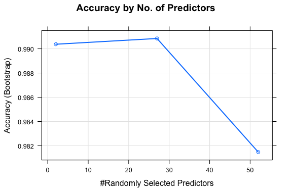

# 08_Identifying Proper Exercise Technique Using Accelerometer Data
Barb Dornseif - Saoirsegirl  
April 23, 2015  
# Summary:  
The following analysis will evaluate a data set taken from a set of accelerometers placed on the belt, forearm, arm, and dumbell of six (6) participants. These six participants were asked to perform one set of 10 repetitions of the Unilateral Dumbbell Biceps Curl in five different fashions:  
    - Class A: exactly according to the specification  
    - Class B: throwing the elbows to the front  
    - Class C: lifting the dumbbell only halfway  
    - Class D: lowering the dumbbell only halfway  
    - Class E: throwing the hips to the front  
Class A is considered a correct execution of the excercise.  

From this data set, a series of model algorithms were run and it was detirmined that a Random Forrest model yielded the best accuracy in predicting the outcomes on the test set. Due to the length of processing time for the models, the outcomes are either hard coded into the paper or pulled from a file of the saved model output. 

# Data Extraction, Formatting and Examinations
The data provided by the original study designers was made available at the [Weight Lifting Excercise summary page](http://groupware.les.inf.puc-rio.br/static/WLE/WearableComputing_weight_lifting_exercises_biceps_curl_variations.csv)  however for the class were were expected to use a shortened version for [training](https://d396qusza40orc.cloudfront.net/predmachlearn/pml-training.csv ) and 20 random rows for [testing](https://d396qusza40orc.cloudfront.net/predmachlearn/pml-testing.csv).  

For purposes of this analysis the data was brought in as follows:

```r
library(caret)
setwd("~/Documents/Coursera/08-PracticalMachineLearning/08_Project")
```

```r
trainURL <- "https://d396qusza40orc.cloudfront.net/predmachlearn/pml-training.csv"
testURL <- "https://d396qusza40orc.cloudfront.net/predmachlearn/pml-testing.csv"
download.file(trainURL, "./Data/training.csv", method = "curl")
download.file(testURL, "./Data/testing.csv", method = "curl")
```

The training data file was loaded into R with the name *trainRaw*. Several iterations were run to successfully load the data in a manner that allowed for subsequent tidying, and model building. To aid these iterations, a data.frame was created with the names, formats, and existance of NAs - *trainRaw_str*. This data.frame was used to apply logic for "Usability", which in turn provided the list of usable columns.  

The functions summary(), str(), and head() were used as well. For brevity, the iterations of functions is use are not included here. The goal of these steps was to remove any column with a high percentage of NAs or blank inputs in order to shorten the processing time of subsequent models. This step reduced the raw file width from 160 columns to 53 columns of data. The new file *use* was then used to complete the segmentation for training and validation. Later, the test set of 20 hold out rows was processed in the same manner.  


```r
## Load the data - iterations were run to detirmine final function variables
trainRaw <- read.table("./Data/training.csv", header = TRUE, sep = ",",
                    stringsAsFactors = FALSE) # we will transform the outcome to a factor variable later
# first make a data.frame of the name, class, and existance of NA for each column
cNames <- names(trainRaw)
cClass <- as.character()
for (i in 1:dim(trainRaw)[2])  {cClass <- c(cClass, class(trainRaw[ , i]))}
hasNA <- as.character()
for (i in 1:dim(trainRaw)[2])  {
    hasNA <- c(hasNA, anyNA(trainRaw[ , i]))}
trainRaw_str <- as.data.frame(cbind(cNames = cNames, cClass = cClass, hasNA = hasNA), stringsAsFactors = FALSE)

# now evaluate the metrics for suitability for use - in this case having no NA and being a metric
useCol <- as.numeric()
for (i in 8:159) {
    if (trainRaw_str[i, 2] != "character") {
        if (trainRaw_str[i, 3] == "FALSE") {
            useCol <- c(useCol, as.numeric(i))  } } }

# create the usable training set and a pre-test evaluator set
use <- trainRaw[ , c(160, useCol)] # Place Output in the first column
use[ ,1] <- as.factor(use[ , 1]) # convert to Factor variable for better porcessing
set.seed <- 432
inTrain <- createDataPartition(y=use$classe, # vector of outcomes
                               p = 0.80, # Percentage to training
                               list=FALSE) 
training <- use[inTrain, ] 
compare <- use[ - inTrain, ]  # we are not "testing" here so I am renaming this hold out set.
summary(training)
```

```
##  classe     roll_belt        pitch_belt          yaw_belt      
##  A:4464   Min.   :-28.90   Min.   :-55.8000   Min.   :-179.00  
##  B:3038   1st Qu.:  1.09   1st Qu.:  1.7800   1st Qu.: -88.30  
##  C:2738   Median :113.00   Median :  5.2700   Median : -13.70  
##  D:2573   Mean   : 64.16   Mean   :  0.2939   Mean   : -11.44  
##  E:2886   3rd Qu.:123.00   3rd Qu.: 14.9000   3rd Qu.:  12.40  
##           Max.   :162.00   Max.   : 60.3000   Max.   : 179.00  
##  total_accel_belt  gyros_belt_x       gyros_belt_y       gyros_belt_z    
##  Min.   : 0.00    Min.   :-1.04000   Min.   :-0.64000   Min.   :-1.4600  
##  1st Qu.: 3.00    1st Qu.:-0.03000   1st Qu.: 0.00000   1st Qu.:-0.2000  
##  Median :17.00    Median : 0.03000   Median : 0.02000   Median :-0.1000  
##  Mean   :11.28    Mean   :-0.00497   Mean   : 0.03961   Mean   :-0.1303  
##  3rd Qu.:18.00    3rd Qu.: 0.11000   3rd Qu.: 0.11000   3rd Qu.:-0.0200  
##  Max.   :29.00    Max.   : 2.22000   Max.   : 0.64000   Max.   : 1.6200  
##   accel_belt_x       accel_belt_y     accel_belt_z     magnet_belt_x   
##  Min.   :-120.000   Min.   :-69.00   Min.   :-275.00   Min.   :-52.00  
##  1st Qu.: -21.000   1st Qu.:  3.00   1st Qu.:-162.00   1st Qu.:  9.00  
##  Median : -15.000   Median : 34.00   Median :-152.00   Median : 35.00  
##  Mean   :  -5.597   Mean   : 30.08   Mean   : -72.21   Mean   : 55.47  
##  3rd Qu.:  -5.000   3rd Qu.: 61.00   3rd Qu.:  28.00   3rd Qu.: 59.00  
##  Max.   :  81.000   Max.   :164.00   Max.   : 105.00   Max.   :485.00  
##  magnet_belt_y   magnet_belt_z       roll_arm         pitch_arm      
##  Min.   :354.0   Min.   :-623.0   Min.   :-180.00   Min.   :-88.800  
##  1st Qu.:581.0   1st Qu.:-375.0   1st Qu.: -31.60   1st Qu.:-26.200  
##  Median :601.0   Median :-320.0   Median :   0.00   Median :  0.000  
##  Mean   :593.7   Mean   :-345.7   Mean   :  17.97   Mean   : -4.737  
##  3rd Qu.:610.0   3rd Qu.:-306.0   3rd Qu.:  77.30   3rd Qu.: 11.100  
##  Max.   :669.0   Max.   : 293.0   Max.   : 180.00   Max.   : 88.500  
##     yaw_arm          total_accel_arm  gyros_arm_x        gyros_arm_y     
##  Min.   :-180.0000   Min.   : 1.00   Min.   :-6.37000   Min.   :-3.4400  
##  1st Qu.: -42.7000   1st Qu.:17.00   1st Qu.:-1.33000   1st Qu.:-0.8000  
##  Median :   0.0000   Median :27.00   Median : 0.08000   Median :-0.2400  
##  Mean   :  -0.4882   Mean   :25.49   Mean   : 0.05218   Mean   :-0.2625  
##  3rd Qu.:  45.3000   3rd Qu.:33.00   3rd Qu.: 1.59000   3rd Qu.: 0.1400  
##  Max.   : 180.0000   Max.   :65.00   Max.   : 4.87000   Max.   : 2.8400  
##   gyros_arm_z      accel_arm_x       accel_arm_y       accel_arm_z     
##  Min.   :-2.330   Min.   :-383.00   Min.   :-318.00   Min.   :-630.00  
##  1st Qu.:-0.070   1st Qu.:-241.00   1st Qu.: -54.00   1st Qu.:-143.00  
##  Median : 0.230   Median : -43.00   Median :  14.00   Median : -47.00  
##  Mean   : 0.269   Mean   : -59.77   Mean   :  32.72   Mean   : -71.28  
##  3rd Qu.: 0.720   3rd Qu.:  84.00   3rd Qu.: 140.00   3rd Qu.:  23.00  
##  Max.   : 3.020   Max.   : 435.00   Max.   : 303.00   Max.   : 292.00  
##   magnet_arm_x     magnet_arm_y     magnet_arm_z    roll_dumbbell    
##  Min.   :-584.0   Min.   :-386.0   Min.   :-597.0   Min.   :-153.71  
##  1st Qu.:-295.0   1st Qu.: -11.0   1st Qu.: 129.0   1st Qu.: -17.64  
##  Median : 296.0   Median : 200.0   Median : 443.0   Median :  48.40  
##  Mean   : 195.1   Mean   : 155.6   Mean   : 306.2   Mean   :  24.24  
##  3rd Qu.: 639.0   3rd Qu.: 322.0   3rd Qu.: 545.0   3rd Qu.:  68.11  
##  Max.   : 782.0   Max.   : 583.0   Max.   : 694.0   Max.   : 153.55  
##  pitch_dumbbell     yaw_dumbbell      total_accel_dumbbell
##  Min.   :-137.34   Min.   :-150.871   Min.   : 0.00       
##  1st Qu.: -40.94   1st Qu.: -77.626   1st Qu.: 4.00       
##  Median : -20.95   Median :  -3.191   Median :10.00       
##  Mean   : -10.69   Mean   :   1.661   Mean   :13.72       
##  3rd Qu.:  17.82   3rd Qu.:  79.108   3rd Qu.:19.00       
##  Max.   : 137.03   Max.   : 154.952   Max.   :58.00       
##  gyros_dumbbell_x    gyros_dumbbell_y  gyros_dumbbell_z  
##  Min.   :-204.0000   Min.   :-2.1000   Min.   : -2.0800  
##  1st Qu.:  -0.0300   1st Qu.:-0.1400   1st Qu.: -0.3100  
##  Median :   0.1300   Median : 0.0300   Median : -0.1300  
##  Mean   :   0.1573   Mean   : 0.0469   Mean   : -0.1249  
##  3rd Qu.:   0.3500   3rd Qu.: 0.2100   3rd Qu.:  0.0300  
##  Max.   :   2.2200   Max.   :52.0000   Max.   :317.0000  
##  accel_dumbbell_x  accel_dumbbell_y accel_dumbbell_z  magnet_dumbbell_x
##  Min.   :-419.00   Min.   :-189     Min.   :-334.00   Min.   :-643.0   
##  1st Qu.: -50.00   1st Qu.:  -8     1st Qu.:-141.00   1st Qu.:-535.0   
##  Median :  -8.00   Median :  43     Median :  -1.00   Median :-479.0   
##  Mean   : -28.48   Mean   :  53     Mean   : -38.15   Mean   :-329.4   
##  3rd Qu.:  11.00   3rd Qu.: 112     3rd Qu.:  38.00   3rd Qu.:-307.0   
##  Max.   : 234.00   Max.   : 315     Max.   : 318.00   Max.   : 584.0   
##  magnet_dumbbell_y magnet_dumbbell_z  roll_forearm      pitch_forearm   
##  Min.   :-3600     Min.   :-262.00   Min.   :-180.000   Min.   :-72.50  
##  1st Qu.:  232     1st Qu.: -45.00   1st Qu.:  -2.145   1st Qu.:  0.00  
##  Median :  311     Median :  14.00   Median :  20.500   Median :  9.38  
##  Mean   :  223     Mean   :  46.29   Mean   :  33.238   Mean   : 10.74  
##  3rd Qu.:  391     3rd Qu.:  96.00   3rd Qu.: 140.000   3rd Qu.: 28.40  
##  Max.   :  632     Max.   : 452.00   Max.   : 180.000   Max.   : 88.70  
##   yaw_forearm      total_accel_forearm gyros_forearm_x   
##  Min.   :-180.00   Min.   :  0.00      Min.   :-22.0000  
##  1st Qu.: -68.95   1st Qu.: 29.00      1st Qu.: -0.2200  
##  Median :   0.00   Median : 36.00      Median :  0.0500  
##  Mean   :  18.97   Mean   : 34.74      Mean   :  0.1547  
##  3rd Qu.: 110.00   3rd Qu.: 41.00      3rd Qu.:  0.5600  
##  Max.   : 180.00   Max.   :108.00      Max.   :  3.9700  
##  gyros_forearm_y     gyros_forearm_z    accel_forearm_x   accel_forearm_y 
##  Min.   : -7.02000   Min.   : -8.0900   Min.   :-498.00   Min.   :-595.0  
##  1st Qu.: -1.49000   1st Qu.: -0.1800   1st Qu.:-180.00   1st Qu.:  55.0  
##  Median :  0.03000   Median :  0.0800   Median : -57.00   Median : 201.0  
##  Mean   :  0.06987   Mean   :  0.1542   Mean   : -62.52   Mean   : 163.5  
##  3rd Qu.:  1.64000   3rd Qu.:  0.4900   3rd Qu.:  76.00   3rd Qu.: 313.0  
##  Max.   :311.00000   Max.   :231.0000   Max.   : 389.00   Max.   : 923.0  
##  accel_forearm_z   magnet_forearm_x  magnet_forearm_y magnet_forearm_z
##  Min.   :-446.00   Min.   :-1280.0   Min.   :-896.0   Min.   :-973.0  
##  1st Qu.:-182.00   1st Qu.: -615.0   1st Qu.:  -3.5   1st Qu.: 190.5  
##  Median : -39.00   Median : -381.0   Median : 591.0   Median : 511.0  
##  Mean   : -54.89   Mean   : -313.8   Mean   : 379.1   Mean   : 393.9  
##  3rd Qu.:  26.00   3rd Qu.:  -78.0   3rd Qu.: 737.0   3rd Qu.: 652.0  
##  Max.   : 291.00   Max.   :  666.0   Max.   :1480.0   Max.   :1090.0
```
We can verify here that the 53 columns are well formed and the data is reasonable to use in a model training function.  

# Model Selection and Evaluation

Given that the output prediction for this data set is a classification of five possible choices, I focused on comparing models that handle classifications - Trees, Random Forrest, and GBM. I had hoped that a basic Tree model would have an acceptable in-sample error rate as it is the easiest model to help explain the influence of the choosen predictors.  Unfortunately the in-sample error rate was quite high, just over 50%. It therefore did not warrant more time and effort. Here is the code that was run. 

```r
fitBit_tree <- train(classe ~ . , method = "rpart", data = training)
print(fitBit_tree$finalModel)
# Visualize tree
par(mfrow = c(1,1))
plot(fitBit_tree$finalModel, uniform = TRUE)
text(fitBit_tree$finalModel, use.n = TRUE, all=TRUE, cex = 1)
predict_tree <- predict(fitBit_tree,newdata=compare)
confusionMatrix(predict_tree, compare$classe)
resample_tree <- print(fitBit_tree$resample)
hist(resample_tree[[ , 1])
# Accuracy .4922
```
The second model I tested was the Random Forrest using the defaults in the train() function. Most notably it uses the Bootstrap method of resampling for variable selection and cross-validation.  

```r
fitBit_rf <- train(classe ~ ., data = training, method = "rf", prox=TRUE)
```
I have saved the output of that model - *fitBit_rf.rda* - and will use it to document the performance of the model here. We see that peak accuracy is acheived at 27 of 52 predictors being used and that error rate redcution is achieved using ~50 trees (sorry plot won't render in Rmd). To reduce processing time of future models, I would recommend those parameters being added to the train.control options of train().  

```r
setwd("~/Documents/Coursera/08-PracticalMachineLearning/08_Project/Answers")
load("fitBit_rf.rda")
# plot(fitBit_rf$finalModel) # will not plot using loaded model file via Rmd.
plot(fitBit_rf,  main = "Accuracy by No. of Predictors", lwd = 2)
```

 

```r
resample_rf <- print(fitBit_rf$resample)
```

```
##     Accuracy     Kappa   Resample
## 1  0.9914396 0.9891904 Resample04
## 2  0.9900034 0.9873594 Resample09
## 3  0.9901876 0.9875702 Resample05
## 4  0.9908652 0.9884453 Resample01
## 5  0.9910855 0.9887241 Resample10
## 6  0.9911196 0.9887569 Resample06
## 7  0.9928894 0.9910090 Resample02
## 8  0.9913853 0.9891200 Resample11
## 9  0.9887543 0.9857911 Resample07
## 10 0.9918952 0.9897458 Resample03
## 11 0.9898886 0.9871996 Resample12
## 12 0.9892286 0.9863566 Resample08
## 13 0.9915166 0.9892556 Resample17
## 14 0.9882940 0.9851970 Resample13
## 15 0.9920498 0.9899523 Resample22
## 16 0.9923585 0.9903180 Resample18
## 17 0.9923278 0.9903052 Resample14
## 18 0.9932955 0.9915194 Resample23
## 19 0.9908018 0.9883653 Resample19
## 20 0.9910607 0.9886832 Resample15
## 21 0.9922734 0.9902527 Resample24
## 22 0.9900973 0.9874472 Resample20
## 23 0.9903912 0.9878489 Resample16
## 24 0.9896319 0.9868892 Resample25
## 25 0.9883922 0.9853201 Resample21
```
The list of 25 resamplings shows us how stable the accuracy is across the 25 bootstraps of the training data.  This bodes well for a reduced out-of-sample error when testing against the validation and final test sets of data.

The resulting model was fed through the predict() function using the validation set of data to evaluate the out-of-sample error rate prior to final testing.

```r
library(caret)
predict_rf <- predict(fitBit_rf, newdata=compare)
```

```
## Loading required package: randomForest
## randomForest 4.6-10
## Type rfNews() to see new features/changes/bug fixes.
```

```r
confusionMatrix(predict_rf, compare$classe)
```

```
## Confusion Matrix and Statistics
## 
##           Reference
## Prediction    A    B    C    D    E
##          A 1116    0    0    0    0
##          B    0  758    0    0    0
##          C    0    1  684    1    0
##          D    0    0    0  642    0
##          E    0    0    0    0  721
## 
## Overall Statistics
##                                           
##                Accuracy : 0.9995          
##                  95% CI : (0.9982, 0.9999)
##     No Information Rate : 0.2845          
##     P-Value [Acc > NIR] : < 2.2e-16       
##                                           
##                   Kappa : 0.9994          
##  Mcnemar's Test P-Value : NA              
## 
## Statistics by Class:
## 
##                      Class: A Class: B Class: C Class: D Class: E
## Sensitivity            1.0000   0.9987   1.0000   0.9984   1.0000
## Specificity            1.0000   1.0000   0.9994   1.0000   1.0000
## Pos Pred Value         1.0000   1.0000   0.9971   1.0000   1.0000
## Neg Pred Value         1.0000   0.9997   1.0000   0.9997   1.0000
## Prevalence             0.2845   0.1935   0.1744   0.1639   0.1838
## Detection Rate         0.2845   0.1932   0.1744   0.1637   0.1838
## Detection Prevalence   0.2845   0.1932   0.1749   0.1637   0.1838
## Balanced Accuracy      1.0000   0.9993   0.9997   0.9992   1.0000
```
The confusion Matrix shows our error rate for this unrelated data set was 99.85%. Given our use of bootstrapping in the model (and the performance hit that involves), and a validation accuracy that was in line with the model accuracy, further cross-validation iterations using a separate set.seed() with each iteration of data splitting was not pursued.  

As this is so high, it seemed silly to run the GBM model, but I did.


```r
fitBit_gbm <- train(classe ~ ., method = 'gbm', data = training, verbose = FALSE)
resample_gbm <- print(fitBit_gbm$resample)
predict_gbm <- predict(fitBit_gbm, newdata=compare)
confusionMatrix(predict_gbm, compare$classe)
# Accuracy = 0.9643
```
While still a respectable 96.43% accurate against the validation set, the GBM did not perform as well as the Random Forrest model.

# Expected Out of Sample Error Rate For the 20 Row Test Data Set
Given the 99+% accuracy of the Random Forrest model against a large set of validation data, and given that points were on the line, I hypothesized a 100% accuracy in predicting the 20 test cases.  If only one was incorrect, that would result in a 95% accuracy rate which was outside the condfidence interval.  Plus it would be mean to "steal" away a point :-) 

# Predictions Against the Test Set  
The choosen model was used to generate the needed files for submission.  

```r
# Generate vector of predictions for submission into grading engine
# Apply all data procedures use on training set to the test set.
testRaw <- read.table("./Data/testing.csv", header = TRUE, sep = ",",
                       stringsAsFactors = FALSE)
use_test <- testRaw[ , c(160, useCol)]
use_test[ ,1] <- as.factor(use_test[ , 1])
str(use_test[ ,1])
predict_submit <- predict(fitBit_rf, newdata=use_test)
answers <- as.character(predict_submit)

# create files for submission
pml_write_files = function(x){
    n = length(x)
    for(i in 1:n){
        filename = paste0("problem_id_",i,".txt")
        write.table(x[i],file=filename,quote=FALSE,row.names=FALSE,col.names=FALSE)
    }
}
pml_write_files(answers)
```

## Thanks and Acknowledgement of the Original Experiment Designers
Read more: http://groupware.les.inf.puc-rio.br/har#ixzz3YCIDMg00
Citations and Thanks - Velloso, E.; Bulling, A.; Gellersen, H.; Ugulino, W.; Fuks, H.  "Qualitative Activity Recognition of Weight Lifting Exercises" Read more: http://groupware.les.inf.puc-rio.br/work.jsf?p1=11201#ixzz3YCGaaFml 
